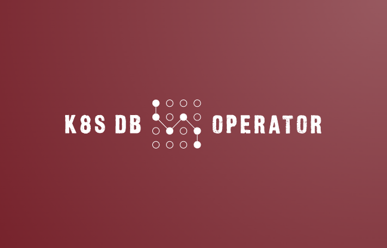
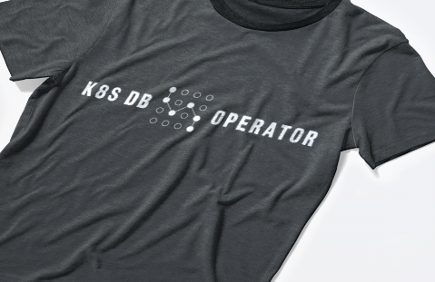

# K8S Database Operator



# Description

Database backup is an essential part of any disaster recovery plan. Automated tools such as scripts and Kubernetes operators can help streamline the process of backing up your data. Scripts can be used to automate the process of creating and storing backups on a regular schedule. Kubernetes operators can also be used to manage the backup process for databases running in a Kubernetes cluster. These tools can help ensure that your data is always backed up and ready to be restored in the event of a disaster.

Kubernetes Custom Resource Definitions (CRDs) allow users to define and manage custom resources within a Kubernetes cluster. This can simplify the process of managing complex applications by allowing users to define their own custom resources that can be managed using the Kubernetes API. CRDs have a rich history, having evolved from Third Party Resources in earlier versions of Kubernetes. They have become a powerful tool for extending the functionality of Kubernetes and simplifying the management of complex applications.

# Getting Started

You’ll need a Kubernetes cluster to run against. You can use KIND to get a local cluster for testing, or run against a remote cluster. Note: Your controller will automatically use the current context in your kubeconfig file (i.e. whatever cluster kubectl cluster-info shows).

## Installing Resources

```bash
kubectl apply -f ./config/crd.yaml
```

## Defining Backup Job

In order to proceed, it is necessary to execute the specified commands and initiate a new job utilizing the provided file. Please regard the following command as an example. All disclaimers and responsibilities are at your discretion.

```bash
apiVersion: ops.db.io/v1alpha1
kind: Backup
metadata:
  name: chess-app-mysql-s2-2023-05-05-15-47-00
spec:
  type: mysql
  dbConnectionUrl: tcp://user7737:badSissPassw@rd@svc-0067.mysql.local/sampledb
```

# Development

In this project, a **Makefile** was utilized to automate all processes. It is highly recommended that the established order be followed for optimal results. The **Makefile** provides a streamlined and efficient method for managing the various tasks required for the project.

Project elimination is also possible through the use of the Makefile. By utilizing the commands provided within the file, team members can easily delegate and manage tasks, ensuring that the project runs smoothly and efficiently.

## Running on the cluster

```bash
make manifests
make generate
make docker-build
make docker-push
kustomize build config/default > crd.yaml
```

## Using in kubernetes 

```bash
kubectl apply -f ~/config/crd.yaml
```

## Uninstall CRDs

To delete the CRDs from the cluster:

```bash
make uninstall
```



# Contribute

We would like to extend a warm welcome to all those interested in contributing to our open source project. this project thrive on the contributions of passionate individuals who are dedicated to improving and advancing the project. We value the input and expertise of our contributors and are always looking for new ideas and perspectives.

However, it is important to note that all contributions must adhere to the established rules and guidelines of the project. These rules are in place to ensure that the project remains organized, efficient, and focused on its goals. By following these guidelines, contributors can ensure that their contributions are valuable and effective.

We encourage all those interested in contributing to take the time to familiarize themselves with the project’s rules and guidelines before submitting their contributions. By adhering to these rules, contributors can help ensure the continued success and growth of the project.